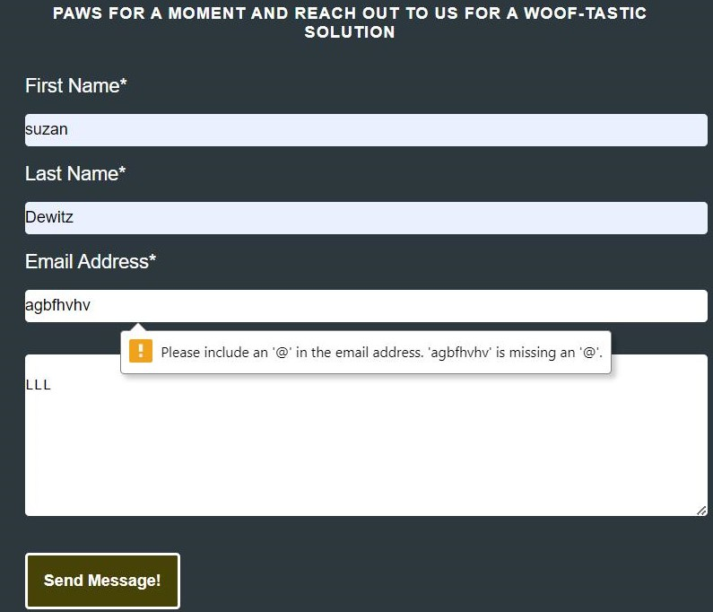

# PORTFOLIO PROJECT - 1

# Pitbull breeders gaiberg

* The HTML code  is a template for a website about a Pitbull breeder located in Gaiberg, Germany.
* The website contains information about the services provided, including dog training, breed selection, and caring for the dogs. 
* The code includes the use of CSS stylesheets, font icons, and Google fonts for styling. 
* The website has four sections: Homepage, Contact, Gallery, and the main content which contains information about the dogs, breeds, training, and care. 
* The main content is divided into three sections: Choose Your Perfect Companion, Train Your Furry Friend with Care, and We Ensure Your Pup's Well-Being. 
* Each section contains a header, a list of related topics, an image, and a description of the topic. The code also includes a navigation menu and a footer that displays the opening hours of the breeder.

  
  

 

 # INITIAL IDEA CONCEPT
 * The initial idea concept of the website appears to be promoting a Pitbull breeding business located in Gaiberg, Germany. 
  The website highlights the various breeds of dogs that they offer and the services they provide, such as training and caring for the dogs. 
   The website also mentions the benefits of owning a pet, such as improving physical and mental health, and encourages people to choose their perfect companion.
 * The website "Pitbull Breeders Gaiberg" is a platform for those who are interested in training and caring for dogs,  specifically the Pitbull breed. The site offers information on different breeds of dogs, including Labrador Retrievers, German Shepherds, Golden Retrievers, Bulldogs, and Poodles.

* The site highlights the importance of training for dogs and lists common training techniques such as positive reinforcement,  obedience training, clicker training, and puppy training. It also provides information on how to ensure the well-being of a dog,  including providing fresh water, taking them for walks or runs, brushing their coat regularly, and visiting a vet for regular check-ups.

* The site also has a contact page for users to get in touch with the owners of the "Pitbull Breeders Gaiberg"  and a gallery page to showcase pictures of different breeds of dogs. The website  features a user-friendly interface with a navigation menu that includes links to the homepage,  contact page, and gallery. The site's design is visually appealing, with images of dogs and information presented in a clear and concise manner.

* The "Pitbull Breeders Gaiberg" website is a valuable resource for those looking to learn more about  dogs and how to care for them properly. It offers a wealth of information on various breeds of dogs  and how to train and care for them, making it a great resource for dog owners, breeders, and dog lovers alike.

 
 

# CONTENTS 

 

[UX/UI](#ux/ui)

[USERSTORIES](#userstories)

   * [AS USER](#userstories)

   * [AS OWNER](#owner) 
  

[WIREFRAMES](#wireframes)

  * [FEATURES](#features)
  * [DESIGN](#design)

     - [HOME](#home)
     - [Navigation bar](#navigation-bar)
     - [Body](#body)
     - [opening](#opening)
     - [Location](#Location)
     - [Footer](#footer)
     - [Color](#color)
     - [Gallery](#gallery)
     - [Color](#color)
     - [contact](#ccontac)
       - ContactFORM
       - ContactValidation

[TESTING](#testing)

  - [DEVICES](#devices)
  - [VALIDATORS](#validators)
  - [LIGHTHOUSE](#lighthouse)
  - [ACCESSIBILITY](#accessibility)

[SOLVED BUGS AND ERRORS](#solved-bugs-and-errors)

   - [UNSOLVED BUGS AND ERRORS](#unsolved-bugs-and-errors)
   - [FUNCTIONALITY](#functionality)

   
[TECHNOLOGIES USED](#technologies-used)

   - [PROGRAMS USED](#programs-used)

[DEPLOYMENT](#deployment)

  - [Development](#development)

[CREDITS](#credits) 

[CODE](#code)

[ACKNOWLEDGEMENTS](#acknowledgements)

 
 

 ## UX/UI
 ## USERSTORIES

 
 

# As user 

 

 *  As a user, I appreciate the ease of navigation and the clear layout of the website. The information is well organized and I am able to quickly find what I am looking for. 
 * As a user, The website should have a user-friendly design and be visually appealing, so I enjoy using it and keep coming back. Additionally, I expect the website to be fast and reliable, with minimal downtime or glitches. Overall, my experience using the website should be positive and leave me feeling satisfied.
 * As a user, I want to be able to easily navigate the website and find the information I need in a clear and concise manner.
 * As a user, I want to be able to interact with the website seamlessly and efficiently, whether it's through clicking links, filling out forms, or making purchases.
 * As a user, I want to find out about the training options/courses provided in order to choose the most appropriate one for me and my dog.

# As owner

 

 * As the owner, Add or remove pages as necessary, such as creating a page for testimonials or information. 

 * As the owner, Customize the website's design and layout to reflect my brand's personality and style.

 * As the owner, Optimize the website for search engines by incorporating keywords, meta descriptions, and header tags.

 * As the owner, Regularly update the website with blog posts or news updates to keep visitors engaged and informed.

 * As the owner, Update the website's content to reflect the current services and offerings provided dog training business.

 * As the owner, Monitor and improve website performance using analytics tools.

 * As the owner, Improve the website's accessibility by ensuring it is responsive and easy to use on different devices and screen sizes.

 * Add security, measures to protect sensitive user data, such as implementing an SSL certificate and updating software and plugins regularly.

  
  
  
  

# WIREFRAMES 
 

* wireframes were created using https://balsamiq.cloud/ during the initial UI design phase:
 
 

 

 
 

   ## FEATURES 

    

* The site consists of:

    * 3 main pages, HOME, CONTACT, GALLERY, 
    * Each page will have the same body layout, HEADER (TITLE), NAVBAR, MAIN CONTENT (TEXT AND IMAGES) and FOOTER (SOCIAL MEDIA ICONS/LINKS, AND LOCATION)
  

## DESIGN  

 
 

###  Home
 

* The HTML (index.html) code  for a webpage that provides information about dog breeders in Gaiberg, Germany.
* The <!DOCTYPE html> declaration is used to specify the HTML version used in the document.
*  The <html> tag sets the language to English using the "lang" attribute.
 * The <head> section contains metadata about the page such as the character encoding, viewport, description, and keywords, which are used by search engines. 
 * The <head> section also links to CSS stylesheets and Google fonts to provide the look and feel of the page. 
 * The <body> section contains the main content of the page, including the header, navigation menu, and sections  for different aspects of dog care and training. Each section has a heading, unordered list, and an accompanying image and text description.  The page includes a footer with information about the location and opening hours of the dog breeders. 

 
 

### Navigation bar:
 

* The navigation bar in this HTML code is defined within the "header" section and is denoted by the "nav" tag. 
 * It is used to display the different pages or sections within the website, providing a way for users to quickly access the various parts of the site. 
 * The navigation bar consists of an unordered list of items, each represented by an "li" tag. Each "li" tag contains a link, represented by the "a" tag, to a specific page or section. 
 * The "active" class is added to the link for the currently viewed page, providing a visual indication to users about their current location within the site. 
 * The links in the navigation bar are styled using CSS and the font used is "Roboto" from Google fonts.
 
 

#### Hover effect on navigating the menu
 

1. When the mouse pointer is over the element, the following changes will occur:

2. The bottom border of the element will change to a 2px solid line with the color #48D1CC.

3. The background color of the element will change to #2F4F4F.

4. The font size of the text inside the element will become 1.2em.

5. A box shadow with a size of 0px 0px 10px and color rgb(127, 6, 6) will appear around the element.

All the changes will happen gradually over a 0.2 second duration, with a smooth ease-in-out effect.

 
 

 

 
 
 
 ### body

 * The body section of the given HTML document contains the main content of the website, including headers, sections, images, and text. 
  * It contains information about dog breeds, dog training, and dog care, organized into distinct sections with respective headers. 
  * The sections contain lists of bullet points and accompanying text that provides further details on each topic. 
  * The body section also includes images to accompany the text and provide visual interest.

 

 
 

### opening hours and contact details

 
 
* opening hours and contact details of a business. 
* The code creates two main divisions: "opening-hours" and "contact-info". The "opening-hours" division displays the business's hours of operation from Monday to Friday (9am-5pm), Saturday (10am-2pm), and Sunday (Closed). 
* The "contact-info" division displays the business's contact information, including phone number (+49 67 954 0000), address (HUSTR 6B, Gaiberg, DE), and email (info@pitbull.com).
* The styling applied to the code includes a background color of light gray (#f1f1f1), a 1px solid gray border with 2px gray box-shadow, and a max-width of 85% with a margin of 0 auto to center the division.
* This code provides important information for customers about a business, including its hours of operation and contact details. 
* The clear and concise display of this information can help customers plan their visits to the business and make contact with the business as needed. 
* By displaying this information on a website or other digital platform, customers can easily access this information at any time, without having to call or visit the business in person. 
* This can help customers save time and make informed decisions, leading to a better customer experience.

  
 

 

  
 

###  Location 
+ The location container with an id of "location-container". Within the container, there is another div with the id of "location". This div contains a google map embedded within an iframe. 
+ The iframe has a width of 600 and a height of 450, and has its border set to 0. The iframe also has a source URL pointing to a google maps page, which will be displayed within the iframe.
+  The map is set to lazy load(technique in web development where resources such as images and videos are loaded only when they  become visible on the user's viewport. This helps to optimize the performance of a website by reducing the amount of data that needs to be loaded,  and by only loading the data that is actually needed. With lazy loading, a page loads faster and uses less bandwidth, which leads to a better user experience.),  and will not have any referrer information sent with it when navigating to a different page.

 
 

 

 
 

###  Footer
  * The footer section is located at the bottom of a webpage and contains information such as the site's copyright notice, links to important pages, and contact information. 
  * The footer is  designed to be smaller and less noticeable than other parts of the website, but still provides important information for users. 
  * It  include elements such as social media icons, a sitemap. 
  * The footer helps to give users an easy way to access important information and provides a clear way to get in touch with the site's creators.

 
 

 

 
 

 

### gallery

* The HTML(gallery.html) code is structure of a website that features a dog training center called "Pitbull Breeders Gaiberg." 
* The website has a header with a logo and a navigation menu with links to three pages, including "Contact," "Gallery," and "Homepage." 
* In the "Gallery" section, there are eight images of dogs with captions related to dog training, each with its own description. 
* The website also includes a Google Maps integration to display the location of the training center and a footer with social media links.

 
 

 
 
 
 

### contact 
* The HTML(contact.html)  code for a "Contact" page for a website about pitbull breeders in Gaiberg, Germany. 
* The page features a contact form for users to fill out and submit, including fields for their first and last name, email address, and a message. 
* The page also includes links to the homepage and a gallery page, as well as social media links for Facebook, Instagram, Twitter, and YouTube.
* A Google Maps embed is included to show the location of the breeders in Gaiberg. The page uses HTML, CSS, and some font-awesome icons.

 
 

 

 

* Contact Form:

  

 * Contact Form:
*  Form validation requests the user to input the correct information in the input fields, This avoids the user sending illegible text/email.

 

 
 

### Color Scheme
 

* The colors used in your dog website are carefully selected to create a visually appealing and cohesive design. 
* The border of the elements has a 2px solid line in a gray-green color (#719176), which provides a clear definition to the elements and draws attention to the content within. 
* The padding of 20px provides a comfortable amount of space between the content and the border. 
* The background color (#1e3e48) is a dark blue-gray, creating a calm and sophisticated atmosphere. 
* The border-radius of 800px gives the elements a soft, rounded edge, adding to the overall aesthetic. 
* The box-shadow with a 3px offset in #888888 provides a subtle, three-dimensional effect that adds depth to the elements. Finally, the text color of #ffffff (white) provides high contrast against the dark background and makes the text easy to read.

 
 

## TESTING 

### Manual Testing
#### DEVICES
+ I have tested in Chrome, Firefox, and Edge on a Windows computer to test the desktop and mobile versions of the website. 
 + I have also used Chrome and Firefox on an Android device, and Safari on an iOS device to test the mobile version. 
 + To ensure the website's functionality, I shared the website with multiple users to get feedback on their experience. They have also tested all internal and external links on the website and confirmed that the contact form requires valid inputs.

 #### Validation
+ There were no errors found on any page using the W3C HTML Validator.
+  HTML (index.html)

 

 
 

+ There were no errors found on any page using the W3C HTML Validator.
+ (contact.html)

 
 

+ There were no errors found on any page using the W3C HTML Validator.

+ (gallery.html)

 
 

There were no errors found on any page using the W3C CSS Validator.

 

 
 

 #### LIGHTHOUSE

 

  + I have been working on lighthouse proformas for the past few weeks and I have gained a good understanding of the concept.  However, I have encountered a challenge with the image size. The images I have used are not of the required size, which has affected the quality of my proformas.

   + Despite this issue, I have been actively working to improve my skills in lighthouse proformas. I have been reading relevant articles,  watching tutorials and practicing on my own. I have also been seeking feedback from my colleagues and making changes based on their suggestions.Going forward,  I plan to take the following steps to resolve the issue with the image size:
  
   - Research and understand the recommended image size for lighthouse proformas.
   - Implement the recommended size in my work going forward.
   - Seek feedback from colleagues and make any necessary changes to improve the quality of my proformas.
   - In conclusion, I am committed to improving my skills in lighthouse proformas and resolving the issue with the image size.  I believe that with continued learning and practice, 
   I will be able to produce high-quality proformas in the future.
   - The reason I say b/c in  different screen sizes I am getting different proformas lighthouse result
 
  

 

  

 

  

 

 
 

 #### ACCESSIBILITY

## SOLVED BUGS AND ERRORS

# BUGS 
+ contact.html  an extra "
" end tag in your code, which is causing an error. A "stray end tag" error occurs when an HTML end tag does not have a matching start tag.
I resolve this issue, by removing the extra "
".

+ index.html Another error message is indicating that the "for" attribute of the "label" element is set to "map", which is the ID of the "iframe" element. I ensures that the label is properly associated with the form control (in this case, the map). 

+ index.html Another error message is indicating that the "section" element is lacking a heading. i improve accessibility and make the content more structured, it's also recommended to add an appropriate heading (e.g. <h2>, <h3>, etc.) to the section. If the section doesn't need a heading, consider using a 
 element instead of a <section> element.in this case i add h2 element the error was solve 

 
 

 

 
  

 
 

#### Unfixed bugs
* There are no unfixed bugs.

   ## TECHNOLOGIES USED
   +  HTML
   +  CSS 
* The languages, frameworks, libraries, and other tools used during this project:
* HTML5 for page basic structure and content;
* CSS3 for content styling;
* Bootstrap was used for grid layout, responsive design, navigation bar and modal implementation, and some additional styling (Jumbotron, buttons);
* Fonts were obtained from Google Fonts;
* Icons were obtained from Font Awesome;
* W3C Markup Validation Service was used to validate HTML and CSS code;
* W3schools.com Color Converter was used to convert colours between default, HEX and RGB for CSS coding purposes;
* Autoprefixer CSS online was used for correct vendor prefixing of CSS styles where required;
* For image convert i used  https://www.freeconvert.com/
* Google Chrome Developer Tools were used for debugging and as a styling aid;
* Gitpod was used as the IDE for development and Git version control;
* GitHub was used for source code storage and site deployment (GitHub Pages).
   
 
 

## DEPLOYMENT

+ This site was deployed using GitHub Pages with the following the steps:
   
1. Click on the Settings icon at the top of page in the navigation bar

2. Scroll down until you see Github Pages

3. There will be a message box saying "Check it out here" Click on the link to take you to the next page

4. Here you will be greeted with a form, Choose the repository Project-1

5. Choose the branch in the drop down box, in this case MAIN

6. Choose the directory in the next drop down box, in this case Root

7. Then click Save

8. It may take a few moments for the site to publish, but once live, the box at the top of the page with the site name will turn green and have 
a Green tick to the left of the link to the live site

9. Another way to find the live site is to navigate to settings, on the left menu click on pages and this will get you to the same point.

+  These commands were used for version control during the project:

   + git add example filename - to add files before committing
   + git commit -m "example message" - to commit changes to the local repository
   + git push - to push all committed changes to the GitHub repository

+ for Readme file 

    + git add README.md
    + git commit -m "docs: add README.md file"
    + git push - to push all committed changes to the GitHub repository

 
 

   The live version of the site is located at:

   [live link](https://suzandewitz.github.io/Dogs-Training/)

 
 

## CREDITS 

* Media
    * The photos used in this site were obtained from  [Free](https://www.pexels.com/)
    * The Location map was obtained from Google Maps.

 
 

## CODE
 * Responsive Design course on Youtube for responsive code in CSS
 * Everybody on slack for pointing me to W3Schools for more in-depth guides to the uses of HTML and CSS

## ACKNOWLEDGEMENTS
* Code institute for the Tutors on the course.
* My classmate Roshna Vakkeel For pushing me to be different in my code.
* My family for their support and patience.
* Everybody on Slack for tips, advice, quick fixes, and kind words.